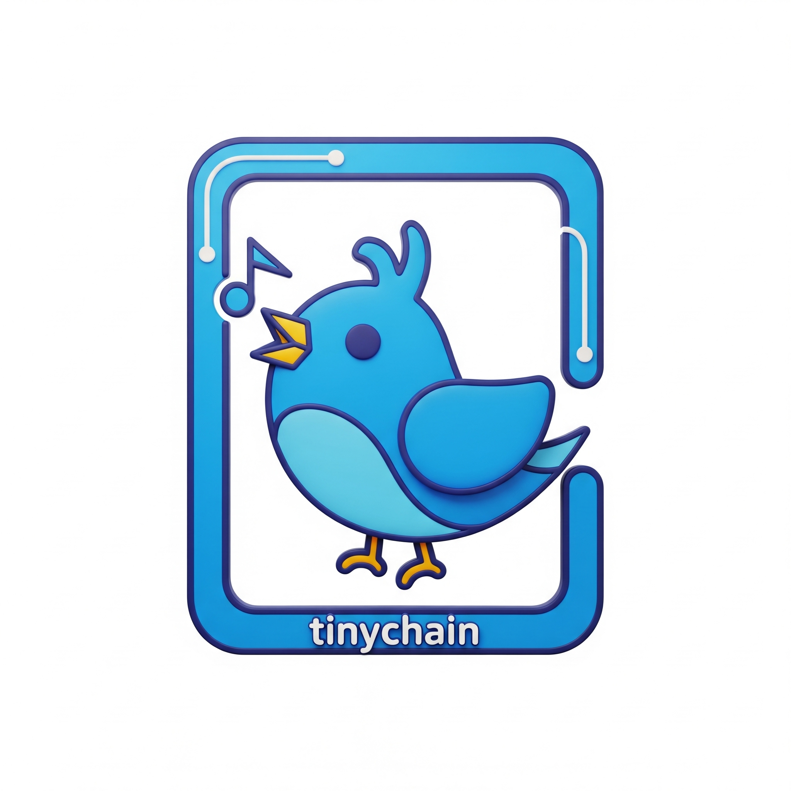

# PromptChain

PromptChain 是一个**轻量级、LLM-based 的框架**，专为希望快速开发 LLM 驱动应用的**个人开发者**设计。作为 Tinychain 的前身，PromptChain 最初是一个探索性项目。经过大半年的发展，LLM 生态发生了翻天覆地的变化，同时我们在 Agent 框架上也积累了宝贵经验，这让我们有信心进行重构，并乐意与大家分享其背后的设计细节。

-----

<div align="center"\>

</div\>

-----

## 🚀 最新动态

  * **DeepSeek 优先支持：** PromptChain 现在优先支持 DeepSeek 模型系列。近期推出的所有新功能都将首先在 DeepSeek 模型上实现，随后才会扩展支持 Ollama 平台上的其他模型。

## 🎯 路线图 (TODO)

  * **MCP 支持：** 即将更新支持 Multi-Chain Processing (MCP) 模式。
  * **链式模式：** 将支持更多高级的链式模式，助力快速开发高效的 LLM 应用，例如 **Snowball (雪球模式)**、**Fallback (回退模式)** 以及 **Human-in-the-Loop (人工介入模式)** 等。

-----

## ✨ 核心特性

  * **轻量与低成本：** 易于集成到现有项目中，引入成本低。
  * **多语言支持：** 计划支持 JavaScript, TypeScript, Java, Go, Rust, C, C++, 和 Scala 等多语言版本。
  * **函数式思想：** 框架核心遵循“一切皆函数”的设计理念，结构清晰。
  * **事件驱动：** 基于事件传递信息，实现模块间的松耦合通信。

-----

## 🛠️ 安装

轻松几步即可开始使用 PromptChain：

```bash
git clone https://github.com/zideajang/promptchain.git
cd promptchain
pip install -e .
```

-----

## 💡 Hello World 示例

通过以下简单示例，快速了解如何使用 PromptChain 构建你的第一个 LLM 链：

```python
import asyncio

from rich.console import Console
from rich.panel import Panel

from promptchain.message import SystemMessage, Message, Messages
from promptchain.prompt import AIMessagePromptTemplate, HumanMessagePromptTemplate
from promptchain.chain_processor import ChainProcessor
from promptchain.processors import PrintMarkdownProcessor
from promptchain.llm import DeepseekChatMessageModel # 注意：现在优先支持Deepseek

console = Console()


async def simple_chain_example():
    # 1. 初始化消息，设置系统角色
    system_message = SystemMessage(content="你是一个 linux 系统")
    
    # 2. 定义提示模板，用于后续的用户和AI交互
    assistant_prompt = AIMessagePromptTemplate.from_template("作为非常有帮助的助手")
    human_prompt = HumanMessagePromptTemplate.from_template("ls")

    # 3. 指定使用的LLM模型 (目前优先支持 DeepSeek)
    model = DeepseekChatMessageModel(name="test") 
    
    # 4. 初始化链式处理器，将系统消息作为初始上下文
    chain = ChainProcessor(Messages(messages=[system_message]))

    # 5. 定义一个Markdown打印处理器，用于输出结果
    print_markdown_tool = PrintMarkdownProcessor(description="print markdown")
    
    # 6. 构建链式操作：通过 `|` 符将各个组件连接起来，形成数据流
    # 每个组件都实现了 Runnable 接口的 invoke 方法
    # 未来将提供Python装饰器，让普通函数也能轻松接入链中
    chain | assistant_prompt | human_prompt | model | print_markdown_tool

    # 7. 启动链并执行所有定义的动作
    await chain.invoke()
    
if __name__ == "__main__":
    asyncio.run(main=simple_chain_example())

```